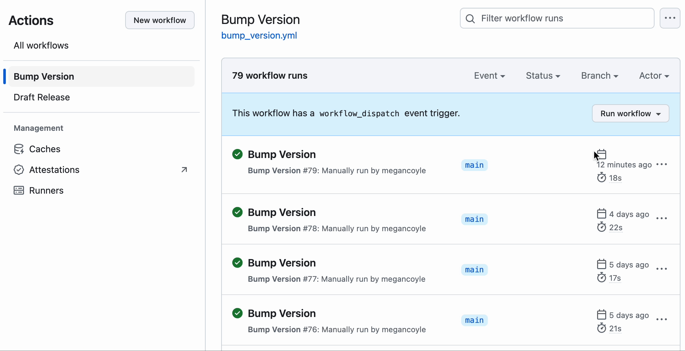
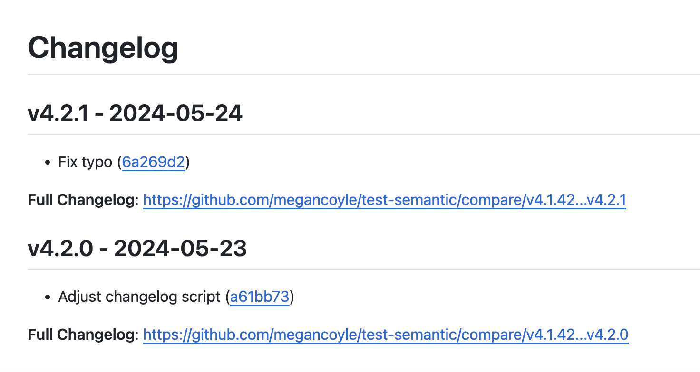

# semver-workflow

Semantic versioning GitHub workflow that bumps your `package.json` and `package-lock.json` files, updates your `CHANGELOG.md`, and creates a draft release automatically tagged with the new release tag.

## Repo Setup

This workflow includes the following workflow files (that you will need to copy into your `.github/workflows` directory):

- [bump_version.yml](.github/workflows/bump_version.yml)
- [draft_release.yml](.github/workflows/draft_release.yml)

And it requires that the following scripts live within the root of your repo:

- [bump_version.cjs](bump_version.cjs)
- [update_changelog.cjs](update_changelog.cjs)

## How It Works

Once the `.github/workflows/bump_version.yml`, `.github/workflows/draft_release.yml`, `bump_version.cjs`, and `update_changelog.cjs` files are copied over to your repo, you can trigger the GitHub action manually when you're ready to bump your repo's version.

You can select `patch`, `minor`, or `major` from the action dropdown to run the workflow manually:

This kicks off the `bump_version.yml` workflow, which reads the current version of your repo specified in your `package.json`. The `bump_version.cjs` script then updates the versioning to the next version based on if you selected patch/minor/major (and increments the semantic versioning associated with your selection).

Then it opens a release PR with a title that follows the following pattern: `chore(release): 4.2.2` where `4.2.2` is replaced with whatever the new version will be for your repo. The PR is tagged with a `release` label.

Once the release PR is merged into your `main` branch, the `draft_release.yml` workflow is triggered. This updates your `CHANGELOG.md` to include an entry with your new version on the top that includes all the commits (and a link to the commit hashes) since the last `chore(release)` PR was merged into `main`:

The `draft_release.yml` workflow also opens up a draft release with the new version as the release title, that's also tagged with a tag that matches the new version number.

### Why Draft a Release?

Instead of automatically publishing a release, this workflow drafts a release to accommodate workflows where deployments are triggered when new releases/release tags are published. This adds a manual step that gives your team more control.